# Howdy!

My name is Dalton. I like writing software that I think is nifty, mostly Go tools that live in your terminal. Hopefully you think so as well!

## Recently Shipped

<a href="https://github.com/DaltonSW/spruce">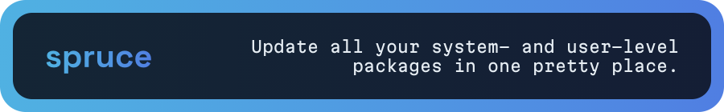</a> 

## Stable Projects

<a href="https://github.com/DaltonSW/aocgo/tree/main/cmd/aocli">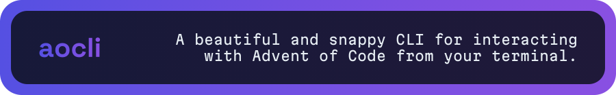</a> 
<a href="https://github.com/DaltonSW/campfire">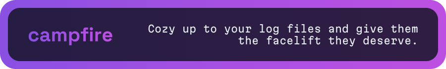</a> 
<a href="https://github.com/DaltonSW/stylish">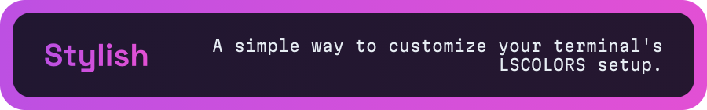</a> 
<a href="https://github.com/DaltonSW/PokeTerm">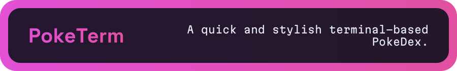</a> 
<a href="https://github.com/DaltonSW/prism">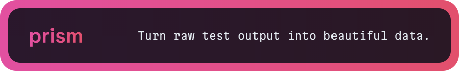</a>

## Go Modules

<a href="https://github.com/DaltonSW/aocgo">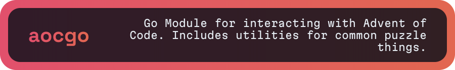</a> 
<a href="https://pkg.go.dev/go.dalton.dog/aocgo">go.dalton.dog/aocgo</a>  
<a href="https://github.com/DaltonSW/BubbleUp">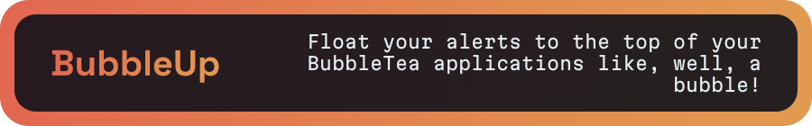</a> 
<a href="https://pkg.go.dev/go.dalton.dog/bubbleup">go.dalton.dog/bubbleup</a>  
<a href="https://github.com/DaltonSW/bark">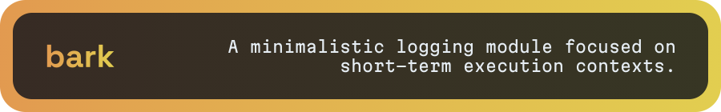</a> 
<a href="https://pkg.go.dev/go.dalton.dog/bark">go.dalton.dog/bark</a>

## WIP Projects

<a href="https://github.com/DaltonSW/Termina">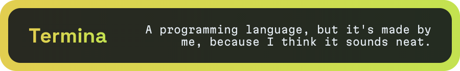</a> 

## Game Jams

<a href="https://github.com/DaltonSW/GMTK2018">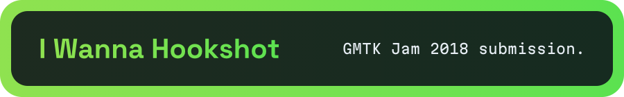</a> 
<a href="https://purplerta.itch.io/i-wanna-hookshot">Itch</a>  
<a href="https://github.com/DaltonSW/MyFirstGameJam-Winter2022">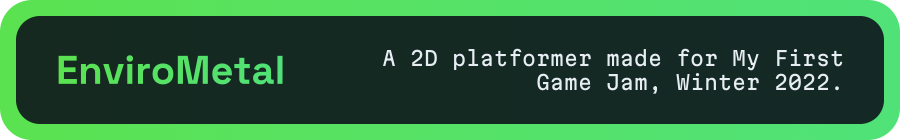</a> 
<a href="https://daltonsw.itch.io/envirometal">Itch</a>  
<a href="https://github.com/DaltonSW/GMTK-22">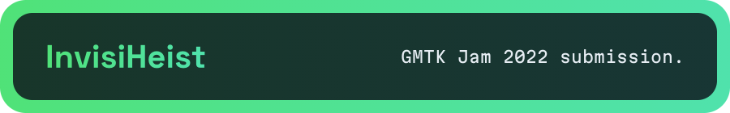</a> 
<a href="https://daltonsw.itch.io/invisiheist">Itch</a>  
<a href="https://github.com/DaltonSW/7DRL-2023">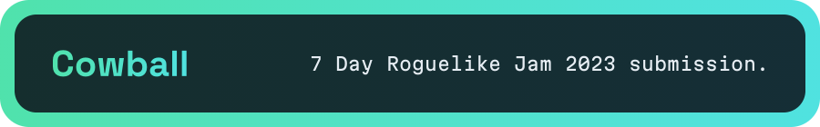</a> 
<a href="https://daltonsw.itch.io/cowball">Itch</a>  
<a href="https://github.com/DaltonSW/MVM23">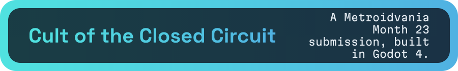</a> 
<a href="https://daltonsw.itch.io/cult-of-the-closed-circuit">Itch</a>

